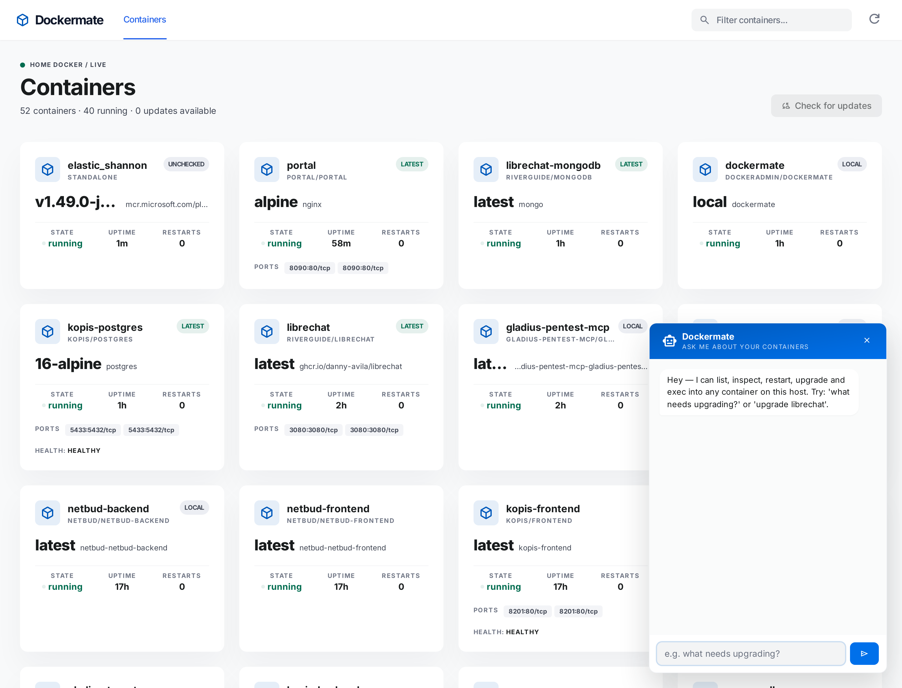

# dockermate

A self-hosted dashboard + chatbot for the Docker host it runs on.



- **Tile grid** of every container — image, version (tag), state, uptime, restarts, ports, health.
- **Soft pulse** on any tile whose registry digest differs from the local image — a one-glance "this needs upgrading" signal.
- **Bottom-right chatbot** (OpenAI / ChatGPT) that can list, inspect, and tail logs freely, and — subject to server-enforced guardrails (see [Chatbot guardrails](#chatbot-guardrails)) — pull, start/stop/restart, run `docker compose pull` + `up -d` against the owning compose file, and `exec` into running containers.
- **Compose-aware upgrades** — when a container has compose labels, the bot recreates it via its original compose file rather than a bare `docker run`, preserving env, volumes, and network config.
- **Cloudflare Access** in front of the public hostname, so the only auth surface is your IdP.

Built for [@sjohnston1972](https://github.com/sjohnston1972)'s home-docker host. Designed to be easy to drop onto any single-host Docker Desktop / Docker Engine setup.

## Stack

| Layer | What |
|---|---|
| Backend | Node.js 20, Express, [`dockerode`](https://github.com/apocas/dockerode), `openai` SDK |
| Frontend | Static HTML + vanilla JS + Tailwind (CDN), Material Symbols, Inter |
| Container | Single image with `docker` CLI + compose plugin baked in |
| Ingress | Cloudflare Tunnel + Access (self-hosted app) |

## Quick start

```bash
cp .env.example .env
# edit .env — set OPENAI_API_KEY at minimum

docker compose --env-file .env up -d --build
```

The container has no host port mapping by default — it expects to be reached on the `net_core` Docker network (e.g. via a Cloudflare Tunnel pointed at `http://dockermate:8080`). To run it standalone, add a port mapping in `docker-compose.yml`:

```yaml
    ports:
      - "8095:8080"
```

…and browse to `http://localhost:8095`.

## How it talks to Docker

| Need | Mount |
|---|---|
| List/inspect/start/stop/restart/exec/pull | `/var/run/docker.sock:/var/run/docker.sock` (Docker Desktop on Windows transparently bridges this to the named pipe) |
| `docker compose pull/up` against your compose files | `C:/docker:/docker` (or wherever your compose tree lives — adjust the bind mount) |

The container's `docker compose` finds each service's compose file via the standard `com.docker.compose.project.config_files` label set on every compose-managed container, then rewrites the host path to its in-container view.

## Image-update detection

For each running container, dockermate:
1. Reads the image's local digest from `docker inspect` → `RepoDigests`.
2. Looks up the same `repo:tag`'s **remote** digest via the registry's `HEAD /v2/<repo>/manifests/<tag>` (Docker Hub & GHCR supported out of the box; other OCI registries fall back to the same generic token endpoint).
3. If the digests differ, the tile pulses and the bot reports it as needing an upgrade.

No image is pulled during the check — only manifest HEAD requests.

## Chatbot

Uses OpenAI's tool-calling. The model has access to:

| Tool | What it does |
|---|---|
| `list_containers` | Full inventory, including compose labels |
| `inspect_container` | Trimmed `docker inspect` |
| `get_logs` | Tail logs (default 200 lines) |
| `check_image_update` | Per-container registry digest check |
| `pull_image` | `docker pull <ref>` |
| `start_container` / `stop_container` / `restart_container` | Lifecycle |
| `compose_pull_service` / `compose_up_service` | Compose-aware upgrade |
| `exec_in_container` | Run a shell command inside a container |

Default model is `gpt-4o-mini`. Set `OPENAI_MODEL=gpt-4o` (or any other tool-capable model) to change it.

## Chatbot guardrails

The model is not trusted to self-police. Guardrails are enforced server-side in `server/chat.js`, not by asking the model nicely:

- **`exec_in_container` is disabled by default.** With `CHAT_ALLOW_EXEC` unset/false, the tool isn't even offered to the model, and a call to it (however constructed) returns a policy error without ever touching Docker. Set `CHAT_ALLOW_EXEC=true` to opt in, optionally scoped further with `CHAT_EXEC_CONTAINER_ALLOWLIST` / `CHAT_EXEC_COMMAND_ALLOWLIST`. See `.env.example` for details — nothing here is silently dropped, it's all recoverable by deliberate config.
- **Every mutating tool call requires a server-enforced confirmation.** `start_container`, `stop_container`, `restart_container`, `pull_image`, `compose_pull_service`, `compose_up_service`, and `exec_in_container` never execute off the model's tool call. Instead the server mints a random, single-use, short-lived (5 min) token bound to that exact tool + arguments and returns it to the browser along with a plain-English description. The UI shows a Confirm/Cancel dialog; only a follow-up `POST /api/chat/confirm` carrying that exact token — which only a human clicking the button can produce — causes the server to run the action. The model never sees the token and cannot mint, guess, or bypass one; a prompt telling the model to "ask first" is not part of this control.

## Security

- **Cloudflare Access is the primary gate**, and dockermate now also verifies it at the origin as defense-in-depth: every `/api/*` request (except `/api/health`) is checked by `server/auth.js`, which either verifies the `Cf-Access-Jwt-Assertion` header's signature/`aud`/expiry against the team's JWKS (`server/access.js`, configured via `ACCESS_TEAM_DOMAIN` + `ACCESS_AUD`) or checks a shared-secret bearer token (`APP_SHARED_SECRET`) — whichever is configured. **This fails closed**: if neither is configured, every protected request is rejected (503) and a loud warning is logged at startup, rather than silently allowing everything through. See `.env.example` for the exact variables.
- The dockermate web UI (`public/auth.js`) sends the shared secret automatically once you've entered it (prompted once, stored in the browser's localStorage); the Access JWT needs no frontend changes since Cloudflare injects it at the edge.
- The chatbot can call `exec_in_container` and `compose_*` operations, gated by the confirmation and exec-policy controls above (see [Chatbot guardrails](#chatbot-guardrails)). That gating is defense in depth, not a substitute for access control — whoever can chat and click Confirm can still effectively root the host. Treat the URL like SSH.
- `.env` is gitignored. Don't commit it.

## Regenerating the screenshot

The screenshot in this README is captured by a one-shot Playwright run against
the live site on the local Docker network. From the project root:

```bash
MSYS_NO_PATHCONV=1 docker run --rm \
  --network net_core \
  -v "$PWD/docs:/work" \
  -w /work \
  mcr.microsoft.com/playwright:v1.49.0-jammy \
  bash -lc "npm install --omit=dev --silent && node screenshot.mjs"
```

(`MSYS_NO_PATHCONV=1` is only needed in Git Bash on Windows.)

## Layout

```
.
├── CLAUDE.md             # AI-assistant brief for working in this repo
├── Dockerfile
├── docker-compose.yml
├── package.json
├── public/               # Static frontend (HTML/CSS/JS)
│   ├── index.html
│   ├── app.js
│   ├── auth.js           # apiFetch() — attaches shared-secret header, prompts once
│   └── styles.css
└── server/               # Express + tools
    ├── index.js          # HTTP API
    ├── auth.js           # /api/* middleware — Access JWT and/or shared secret, fails closed
    ├── access.js         # Cloudflare Access JWT verifier (JWKS fetch/cache, aud + expiry)
    ├── docker.js         # dockerode wrappers
    ├── compose.js        # spawn `docker compose ...`
    ├── registry.js       # remote digest lookups
    └── chat.js           # OpenAI tool-calling loop
```

## License

MIT. Use at your own risk — see Security above.
